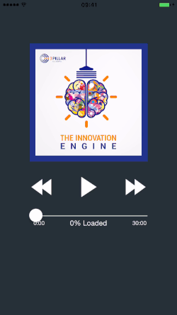

# iOS Audio Player

iOSAudioPlayer is a Swift based iOS module that provides player control features. This module represents a wrapper over AVPlayer.



**Project Rationale**

The purpose of the framework is to provide a simple in app solution for player controls, by offering the following features:

*	Play & pause functionality
*	Player items management
*	Notifications triggered for main player states
*	Notifications triggered for each media item package load
*	Skip a certain time interval methods
* 	Seek to a certain offset method
*	Play in background and control from springboard when in sleep state

## Requirements

- iOS 8.0+
- Xcode 8.2+

## Communication

- If you **found a bug**, open an issue [github](https://github.com/3pillarlabs/ios-audio-player/issues/new).
- If you **have a feature request**, open an issue [github](https://github.com/3pillarlabs/ios-audio-player/issues/new).
- If you **want to contribute**, submit a pull request [github](https://github.com/3pillarlabs/ios-audio-player/compare).

## Installation
### CocoaPods

[CocoaPods](http://cocoapods.org) is a dependency manager for Cocoa projects and is the preferred method of installation.

Install the latest version of CocoaPods with the following command:

```bash
$ gem install cocoapods
```

To integrate iOSAudioPlayer into your Xcode project that does not have CocoaPods integrated, you need to run in your project's folder the command:
```bash
$ pod init
```
This will create a new file called `Podfile`.

After this you need to add a new entry in your target's pods specifications.
```ruby
pod 'iOSAudioPlayer'
```
Once this is done, in your `Podfile` you should have something like this:
```ruby
platform :ios, '8.0'
use_frameworks!

target 'yourTargetName' do
    pod 'iOSAudioPlayer'
end
```

To integrate iOSAudioPlayer into your Xcode project that already has CocoaPods integrated, just add in your `Podfile`:
```ruby
pod 'iOSAudioPlayer'
```
Once this is done, in your `Podfile` you should have something like this:
```ruby
platform :ios, '8.0'
use_frameworks!

target 'yourTargetName' do
    // other pods
    pod 'iOSAudioPlayer'
end
```

Then, run the following command:
```bash
$ pod update
```

Inside your code, in the file where you want to use the iOSAudioPlayer classes, add the following import statement:
```swift
import iOSAudioPlayer
```

### Manually

If you prefer not to use CocoaPods, you can integrate iOSAudioPlayer into your project manually.

#### Source File

If you prefer to rock it old-school, iOSAudioPlayer can be integrated by adding all the Swift files located inside the `Classes` directory (`Classes/*.*`) directly into your project. Note that you will no longer need to `import iOSAudioPlayer` since you are not actually loading a framework.

---

#Usage
- Use shared instance of TPGAudioPlayer class, by calling TPGAudioPlayer.sharedInstance().
- Play a certain media file by calling method:
```swift
public func playPauseMediaFile(audioUrl: NSURL, springboardInfo: [String : AnyObject], startTime: Double, completion: (previousItem: String?, stopTime: Double) -> ())
```
- Skip a certain time interval using method:
```swift
public func skipDirection(skipDirection: iOSAudioPlayer.SkipDirection, timeInterval: Double, offset: Double)
```
- Seek the player to a certain offset:
```swift
public func seekPlayerToTime(value: Double, completion: (() -> Void)!)
```
- Check the duration of the current player item:
```swift
public var durationInSeconds: Double { get }
```
- Check current progress of the player on the current player item:
```swift
public var currentTimeInSeconds: Double { get }
```
- Listen to the notification which is triggered when a certain media file package is loaded:
```swift
public let TPGMediaLoadedStateNotification: String
```
In the "Example for iOSAudioPlayer" project you're able to see how the framework is used.


## About this project

![3Pillar Global] (http://www.3pillarglobal.com/wp-content/themes/base/library/images/logo_3pg.png)

**iOSAudioPlayer** is developed and maintained by [3Pillar Global](http://www.3pillarglobal.com/).

## License

iOSAudioPlayer is available under the MIT license. See the LICENSE file for more info.
